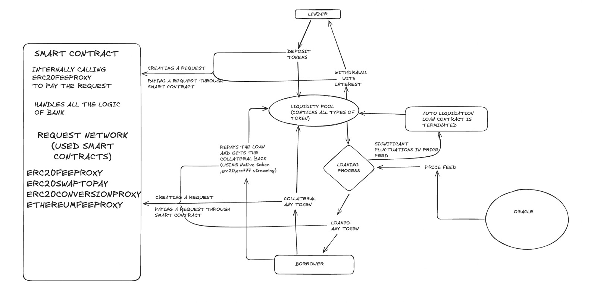

This is a [Next.js](https://nextjs.org) project bootstrapped with [`create-next-app`](https://nextjs.org/docs/app/api-reference/cli/create-next-app).
# BankOnRequest
BankOnRequest is a decentralised bank application built on top of sepolia blockchain and request network.In this bank anybody can lend anytoken and can earn the constant interest of 8% on that token. Also anybody can borrow any token for the collateral of any other token for the 12% interest on the borrowing token on the basis of price feed provided by Oracle.The borrower can do the payment in native currency,ERC20 currency and ERC777 stream payment.User can track their transactions with the help of request network.
## Getting Started

First, run the development server:

```bash
npm run dev
# or
yarn dev
# or 
pnpm dev
# or
bun dev
```

Open [http://localhost:3000](http://localhost:3000) with your browser to see the result.

You can start editing the page by modifying `app/page.tsx`. The page auto-updates as you edit the file.

This project uses [`next/font`](https://nextjs.org/docs/app/building-your-application/optimizing/fonts) to automatically optimize and load [Geist](https://vercel.com/font), a new font family for Vercel.

## Usage

- You can lend and borrow tokens on the basis of real time market data using the frontend GUI (**Graphical User Interface**) or the one deployed [Link](https://bank-on-request.vercel.app/).


## Implementation Details



## Demo Video Link
Click [here]() to see a working demo!

## Learn More

To learn more about Request Network, take a look at the following resources:
- [RequestNetwork Documentation](https://docs.request.network/) - learn about Request Network features.
- [Next.js Documentation](https://nextjs.org/docs) - learn about Next.js features and API.
